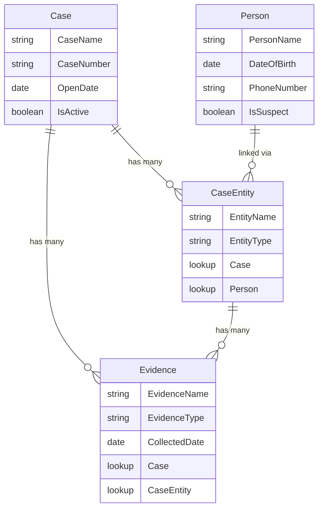

# Roadmap: Embedding NEXUS Investigation Board into D365 Power Apps

## Background

The NEXUS Investigation Board visualisation is built and working locally with mock data. The Dataverse tables (Case, Person, Case Entity, Evidence) are already created and imported into a D365 Power App. This roadmap covers how to connect everything end-to-end.

---

## Your Dataverse Schema



---

## Phase 1 — PCF Project Scaffolding

This converts your existing React code into a proper PCF component that D365 can load.

### Steps

1. **Install Power Platform CLI** (one-time)
   ```bash
   npm install -g powerapps-cli
   pac install latest
   ```

2. **Initialise a new PCF project** (in a separate folder)
   ```bash
   mkdir NexusBoardPCF && cd NexusBoardPCF
   pac pcf init --namespace NCSNexus --name InvestigationBoard --template field --run-npm-install
   ```

3. **Copy your existing `src/` code** into the PCF project
   - All components, hooks, types, utils, styles → `InvestigationBoard/src/`

4. **Create the PCF wrapper** (`InvestigationBoard/index.ts`)
   - This is the bridge between the PCF lifecycle and your React app
   - PCF gives you the `context` object → you extract the bound **Case ID** from it
   - You pass that Case ID into your React `<App />` component as a prop

```typescript
// Simplified PCF index.ts structure
export class InvestigationBoard implements ComponentFramework.StandardControl<IInputs, IOutputs> {
    private container: HTMLDivElement;
    private caseId: string;

    public init(context: ComponentFramework.Context<IInputs>, container: HTMLDivElement) {
        this.container = container;
        // Get the case record ID from the bound field or context
        this.caseId = context.parameters.caseId.raw ?? '';
        this.renderApp();
    }

    public updateView(context: ComponentFramework.Context<IInputs>) {
        const newId = context.parameters.caseId.raw ?? '';
        if (newId !== this.caseId) {
            this.caseId = newId;
            this.renderApp();
        }
    }

    private renderApp() {
        const root = createRoot(this.container);
        root.render(<App caseId={this.caseId} webAPI={...} />);
    }

    public destroy() { /* unmount React */ }
}
```

5. **Update `ControlManifest.Input.xml`** to declare the bound property
   ```xml
   <property name="caseId" display-name-key="Case ID"
             of-type="SingleLine.Text" usage="bound" required="true" />
   ```

> [!IMPORTANT]
> The PCF `context.webAPI` gives you direct access to Dataverse CRUD operations — **no need for manual `fetch()` calls**. Use `context.webAPI.retrieveMultipleRecords()` instead.

---

## Phase 2 — Dataverse Data Layer

This is the core integration — fetching real data from your tables and mapping it to graph nodes/links.

### 2.1 — Schema → Graph Mapping

| Dataverse Table | → | Graph Node Type | Shape |
|---|---|---|---|
| **Case** (the current record) | → | `case` (centre node) | Hexagon |
| **Person** (via Case Entity) | → | `person` | Circle |
| **Case Entity** (junction rows) | → | `caseEntity` | Pill / Rect |
| **Evidence** | → | `evidence` | Document rect |

### 2.2 — API Queries to Make

When the component loads with a given `caseId`, make these parallel queries:

```typescript
// dataverse.ts — Data fetching layer

export async function fetchGraphData(
    webAPI: ComponentFramework.WebApi,
    caseId: string
): Promise<GraphData> {

    // 1. Fetch the Case record itself
    const caseRecord = await webAPI.retrieveRecord(
        "ncs_case", caseId,
        "?$select=ncs_casename,ncs_casenumber,ncs_opendate,ncs_isactive"
    );

    // 2. Fetch all Case Entities linked to this case
    const caseEntities = await webAPI.retrieveMultipleRecords(
        "ncs_caseentity",
        `?$select=ncs_entityname,ncs_entitytype,_ncs_person_value` +
        `&$filter=_ncs_case_value eq '${caseId}'`
    );

    // 3. Fetch all Persons referenced by Case Entities
    const personIds = caseEntities.entities
        .map(e => e._ncs_person_value)
        .filter(Boolean);
    // Batch or filter query for persons
    const persons = await webAPI.retrieveMultipleRecords(
        "ncs_person",
        `?$select=ncs_personname,ncs_dateofbirth,ncs_phonenumber,ncs_issuspect` +
        `&$filter=${personIds.map(id => `ncs_personid eq '${id}'`).join(' or ')}`
    );

    // 4. Fetch all Evidence linked to this case
    const evidence = await webAPI.retrieveMultipleRecords(
        "ncs_evidence",
        `?$select=ncs_evidencename,ncs_evidencetype,ncs_collecteddate,_ncs_caseentity_value` +
        `&$filter=_ncs_case_value eq '${caseId}'`
    );

    // 5. Map to GraphNode[] and GraphLink[]
    return mapToGraphData(caseRecord, caseEntities, persons, evidence);
}
```

> [!WARNING]
> Replace `ncs_` with your actual Dataverse **publisher prefix**. Check the table schema names in the Power Apps maker portal under **Tables → <Table> → Properties → Name**.

### 2.3 — Mapping Function

```typescript
function mapToGraphData(
    caseRecord: any,
    caseEntities: any,
    persons: any,
    evidence: any
): GraphData {
    const nodes: GraphNode[] = [];
    const links: GraphLink[] = [];

    // Case node (centre)
    nodes.push({
        id: caseRecord.ncs_caseid,
        type: 'case',
        label: caseRecord.ncs_casenumber,
        sublabel: caseRecord.ncs_casename,
        radius: 36,
        details: { /* map fields */ }
    });

    // Person nodes
    persons.entities.forEach(p => {
        nodes.push({
            id: p.ncs_personid,
            type: 'person',
            label: p.ncs_personname,
            sublabel: p.ncs_issuspect ? 'Suspect' : 'Person',
            radius: 24,
            details: { /* map fields */ }
        });
    });

    // Case Entity nodes + links
    caseEntities.entities.forEach(ce => {
        nodes.push({
            id: ce.ncs_caseentityid,
            type: 'caseEntity',
            label: ce.ncs_entityname,
            sublabel: ce.ncs_entitytype,
            radius: 18,
            details: { /* map fields */ }
        });
        // Link: Case → CaseEntity
        links.push({ source: caseRecord.ncs_caseid, target: ce.ncs_caseentityid, label: 'entity' });
        // Link: CaseEntity → Person (if linked)
        if (ce._ncs_person_value) {
            links.push({ source: ce.ncs_caseentityid, target: ce._ncs_person_value, label: 'person' });
        }
    });

    // Evidence nodes + links
    evidence.entities.forEach(ev => {
        nodes.push({
            id: ev.ncs_evidenceid,
            type: 'evidence',
            label: ev.ncs_evidencename,
            sublabel: ev.ncs_evidencetype,
            radius: 20,
            details: { /* map fields */ }
        });
        // Link: Case → Evidence
        links.push({ source: caseRecord.ncs_caseid, target: ev.ncs_evidenceid, label: 'evidence' });
        // Link: Evidence → CaseEntity (if linked)
        if (ev._ncs_caseentity_value) {
            links.push({ source: ev.ncs_evidenceid, target: ev._ncs_caseentity_value, label: 'linked' });
        }
    });

    return { nodes, links };
}
```

---

## Phase 3 — Update Types & UI

### 3.1 — Adapt [EntityType](file:///d:/ncs-nexus-investigation-board/Nexus-investigation-board/src/types/index.ts#3-4) to match your tables

```diff
- export type EntityType = 'case' | 'contact' | 'connection' | 'annotation' | 'related';
+ export type EntityType = 'case' | 'person' | 'caseEntity' | 'evidence';
```

### 3.2 — Update detail interfaces to match Dataverse columns

| Old Interface     | New Interface     | Fields from Dataverse                              |
|---|---|---|
| [CaseDetails](file:///d:/ncs-nexus-investigation-board/Nexus-investigation-board/src/types/index.ts#19-33)     | [CaseDetails](file:///d:/ncs-nexus-investigation-board/Nexus-investigation-board/src/types/index.ts#19-33)     | CaseName, CaseNumber, OpenDate, IsActive           |
| [ContactDetails](file:///d:/ncs-nexus-investigation-board/Nexus-investigation-board/src/types/index.ts#34-51)  | `PersonDetails`   | PersonName, DateOfBirth, PhoneNumber, IsSuspect     |
| [ConnectionDetails](file:///d:/ncs-nexus-investigation-board/Nexus-investigation-board/src/types/index.ts#52-68) | `CaseEntityDetails` | EntityName, EntityType                           |
| [AnnotationDetails](file:///d:/ncs-nexus-investigation-board/Nexus-investigation-board/src/types/index.ts#69-84) | `EvidenceDetails`  | EvidenceName, EvidenceType, CollectedDate          |
| [RelatedCaseDetails](file:///d:/ncs-nexus-investigation-board/Nexus-investigation-board/src/types/index.ts#85-100) | *(remove)*      | Not in current schema                              |

### 3.3 — Update constants, sidebar rendering, legend panel

- Update entity colours, shapes, labels, radii
- Update [EntityDetailContent.tsx](file:///d:/ncs-nexus-investigation-board/Nexus-investigation-board/src/components/sidebar/EntityDetailContent.tsx) to render Person / CaseEntity / Evidence fields
- Update [LegendPanel.tsx](file:///d:/ncs-nexus-investigation-board/Nexus-investigation-board/src/components/graph/LegendPanel.tsx) shape SVGs

---

## Phase 4 — Local Testing

### PCF Test Harness

```bash
cd NexusBoardPCF
npm start watch    # Opens localhost:8181 with PCF test harness
```

> [!NOTE]
> The PCF test harness lets you mock bound properties (like `caseId`) and preview the component locally. However, `context.webAPI` won't work locally — you'll need a **fallback to mock data** during development.

### Recommended pattern: Dual-mode data layer

```typescript
// In App.tsx
const data = webAPI
    ? await fetchFromDataverse(webAPI, caseId)   // Real D365
    : MOCK_GRAPH_DATA;                            // Local dev
```

---

## Phase 5 — Package & Deploy to D365

### 5.1 — Build the PCF solution

```bash
# From the PCF project root
mkdir Solutions && cd Solutions
pac solution init --publisher-name NCS --publisher-prefix ncs
pac solution add-reference --path ..
msbuild /t:build /restore /p:configuration=Release
```

This produces a `.zip` file in `Solutions/bin/Release/`.

### 5.2 — Import into D365

1. Go to **Power Apps** → **Solutions** → **Import Solution**
2. Upload the `.zip` file
3. Publish all customisations

### 5.3 — Add to the Case Form

1. Open the **Case** table form in the **Form Designer**
2. Add a new **Tab** called "Investigation Board"
3. Add a **Custom Control** to a field on that tab
4. Select your **InvestigationBoard** PCF component
5. Bind the `caseId` property to the Case record's primary key
6. Save and publish the form

---

## Summary — Execution Order

| # | Phase | Est. Effort | Depends On |
|---|---|---|---|
| 1 | PCF scaffolding + wrapper | 2–3 hours | Power Platform CLI installed |
| 2 | Dataverse data layer ([dataverse.ts](file:///d:/ncs-nexus-investigation-board/Nexus-investigation-board/src/data/dataverse.ts)) | 3–4 hours | Schema prefix confirmed |
| 3 | Update types, sidebar, legend | 2–3 hours | Phase 2 complete |
| 4 | Local testing with mock fallback | 1–2 hours | Phase 3 complete |
| 5 | Package, deploy, bind to form | 1–2 hours | Phase 4 complete |

## Verification Plan

### Local (before deploy)
- Run `npm start watch` in PCF project → confirm component renders in test harness with mock data
- Confirm TypeScript compiles: `tsc --noEmit`

### After deploy
- Open a Case record in D365 → navigate to "Investigation Board" tab
- Verify graph renders with real data from that case's linked entities
- Click nodes → confirm sidebar shows correct Dataverse field values
- Verify filter toggles hide/show correct entity types

> [!IMPORTANT]
> **Before starting Phase 2**, please confirm your Dataverse **publisher prefix** (e.g., `ncs_`, `cr4e7_`, etc.) — all table and column logical names depend on this.
