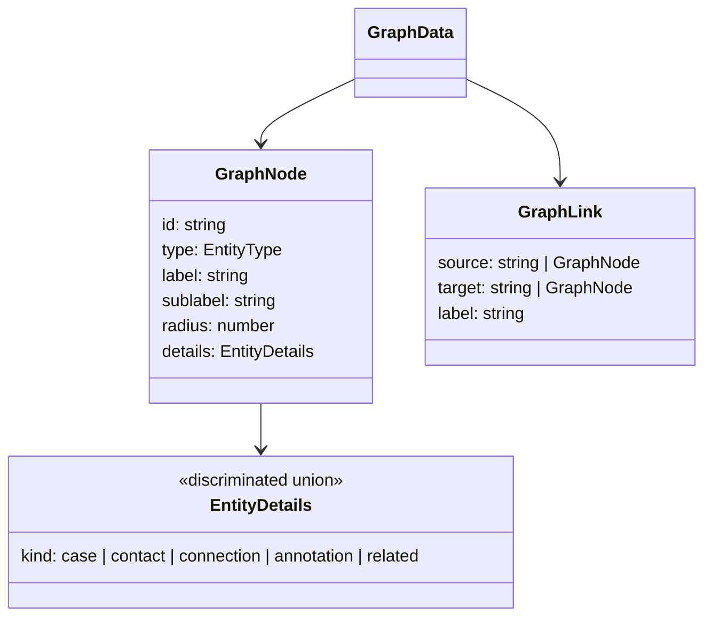

# NEXUS Investigation Board — Development Documentation

**Component**: PCF (Power Apps Component Framework) React Component
**Stack**: React 19 · TypeScript 5 · D3.js 7 · Vite 8
**Target**: Embed inside a Dynamics 365 Case form as a custom tab/component
**Local path**: `d:\ncs-nexus-investigation-board\Nexus-investigation-board`

---

## 1. Purpose

A D3.js force-directed graph that visualises **Dataverse case entity relationships** as an interactive investigation board. When embedded inside a D365 Case record, it renders all linked entities (contacts, connections, annotations, related cases) as a navigable node graph with a detail sidebar.


---

## 2. Project Structure (Active Files)

```
Nexus-investigation-board/
├── entry/
│   └── main.tsx                        # React DOM entry point
├── src/
│   ├── App.tsx                         # Root component, state management
│   ├── types/
│   │   └── index.ts                    # All TypeScript interfaces & types
│   ├── data/
│   │   └── mockData.ts                 # Fabricated Dataverse data (replace with API)
│   ├── hooks/
│   │   └── useD3Graph.ts               # D3 force simulation, rendering, interactions
│   ├── utils/
│   │   └── constants.ts                # Entity colors, labels, icons, radii
│   ├── components/
│   │   ├── graph/
│   │   │   ├── GraphCanvas.tsx         # SVG wrapper, tooltip, ambient blobs
│   │   │   ├── GraphControls.tsx       # Zoom/fit/reheat buttons
│   │   │   └── LegendPanel.tsx         # Type legend with filter toggles
│   │   └── sidebar/
│   │       ├── EntitySidebar.tsx        # Slide-in panel container
│   │       ├── EntityDetailContent.tsx  # Per-type detail renderer
│   │       ├── SidebarFields.tsx        # Field, Section, Timeline, TagRow, NoteBlock
│   │       └── RelatedCasesAccordion.tsx # Expandable related cases list
│   └── styles/
│       └── main.css                    # Complete design system CSS
├── index.html                          # Vite HTML entry
├── vite.config.ts                      # Vite + React plugin config
├── tsconfig.json
├── package.json
└── README.md
```

> [!NOTE]
> Files like [TopBar.tsx](file:///d:/ncs-nexus-investigation-board/Nexus-investigation-board/src/components/layout/TopBar.tsx), [CaseBand.tsx](file:///d:/ncs-nexus-investigation-board/Nexus-investigation-board/src/components/layout/CaseBand.tsx), [LoadingScreen.tsx](file:///d:/ncs-nexus-investigation-board/Nexus-investigation-board/src/components/ui/LoadingScreen.tsx), `SearchBar.tsx`, `Toast.tsx`, `useLoadingSequence.ts`, and `useToast.ts` still exist on disk but are **no longer imported**. They were removed from the active app during the PCF embedding cleanup.

---

## 3. Entity Types & Visual Encoding

| Entity Type  | D3 Shape       | Color     | CSS Var         | Radius | Example                    |
|------------- |--------------- |---------- |---------------- |------- |--------------------------- |
| `case`       | Hexagon        | `#ff5f5f` | `--c-case`      | 36     | CR-2024-0091               |
| `contact`    | Circle         | `#ff9040` | `--c-contact`   | 24     | Marcus Henley (Suspect)    |
| `connection` | Pill / Rect    | `#f0d040` | `--c-conn`      | 18     | Vehicle Ownership          |
| `annotation` | Document rect  | `#3ed98a` | `--c-annot`     | 20     | Post-Mortem Report (PDF)   |
| `related`    | Dashed diamond | `#4ca8ff` | `--c-related`   | 22     | CR-2023-0055 (Arson case)  |

Each node has:
- An **outer glow ring** (glow filter on hover/select)
- An optional **inner ring** (case hexagon + contact circle)
- An **emoji icon** (📁 / 👤 / 🔗 / 📎 / ⬡)
- **Label** + **sublabel** text below the shape

---

## 4. Key Features Implemented

### 4.1 D3 Force Graph ([useD3Graph.ts](file:///d:/ncs-nexus-investigation-board/Nexus-investigation-board/src/hooks/useD3Graph.ts))

- Force simulation with `forceLink`, `forceManyBody`, `forceCollide`, `forceX`, `forceY`
- Per-type link distances (connections closer, related cases further)
- Center node (case) is **pinned** (`fx`/`fy`) at viewport centre
- SVG defs: per-type arrow markers, glow filters, selected-glow filters, dot grid pattern
- **Drag** behaviour (unpin on drag end, except case node)
- **Zoom & pan** via `d3.zoom` (scale 0.15–4x)

### 4.2 Neighbourhood Highlighting

Clicking a node:
1. Identifies all directly connected neighbours via link traversal
2. Dims non-neighbours to `opacity: 0.12`
3. Boosts selected node glow (`glow-selected-*` filter)
4. Reduces link opacity for non-incident edges

Clicking background resets all to full opacity.

### 4.3 Type Filter Legend ([LegendPanel.tsx](file:///d:/ncs-nexus-investigation-board/Nexus-investigation-board/src/components/graph/LegendPanel.tsx))

- Displays all 5 entity types with shape SVGs and node counts
- Click a type to **toggle visibility** (filtered nodes → `opacity: 0.08`)
- "Reset" button clears all filters
- Panel shifts left when sidebar is open (`legend-shifted` class)

### 4.4 Graph Controls ([GraphControls.tsx](file:///d:/ncs-nexus-investigation-board/Nexus-investigation-board/src/components/graph/GraphControls.tsx))

| Button        | Action                                    |
|-------------- |------------------------------------------ |
| **+**         | Zoom in 1.35×                             |
| **−**         | Zoom out 0.74×                            |
| **⊞ (Fit)**   | Reset transform to centre, scale 0.8      |
| **↻ (Reheat)**| Restart simulation with `alpha(0.5)`      |

### 4.5 Entity Sidebar ([EntitySidebar.tsx](file:///d:/ncs-nexus-investigation-board/Nexus-investigation-board/src/components/sidebar/EntitySidebar.tsx))

- **400px slide-in panel** from the right (`transform: translateX`)
- Backdrop overlay for click-away dismissal
- Accent line coloured by entity type
- Header: icon, type label, entity name, Dataverse ID
- **"Open Record in Dataverse"** button
- Body: type-specific detail renderer via discriminated union (`details.kind`)

### 4.6 Per-Type Detail Rendering ([EntityDetailContent.tsx](file:///d:/ncs-nexus-investigation-board/Nexus-investigation-board/src/components/sidebar/EntityDetailContent.tsx))

Uses a `switch` on `details.kind` to render type-specific fields:

| Entity Type  | Sections Displayed                                                      |
|------------- |------------------------------------------------------------------------ |
| `case`       | Case ID, Status, Priority, Type, Opened, Lead, Description, Tags, Timeline |
| `contact`    | Role, Status, DOB, Phone, Address, Occupation, Priors, Note, Tags, Timeline, Related Cases |
| `connection` | From, To, Type, Status, Confirmed By, Since, Note, Tags, Timeline      |
| `annotation` | Doc Type, Created By, Date, Status, Subject, Content, Tags, Timeline, Related Cases |
| `related`    | Link Type, Confidence, Status, Closed Date, Overlap, Link Reason, Tags, Timeline, Related Cases |

### 4.7 Related Cases Accordion ([RelatedCasesAccordion.tsx](file:///d:/ncs-nexus-investigation-board/Nexus-investigation-board/src/components/sidebar/RelatedCasesAccordion.tsx))

- Expandable accordion with case count badge
- Each item shows: Case ID, Name, Match Reason, Status (colour-coded bar)
- Clicking navigates to the related case (currently logs to console)

---

## 5. TypeScript Type System ([types/index.ts](file:///d:/ncs-nexus-investigation-board/Nexus-investigation-board/src/types/index.ts))



The [EntityDetails](file:///d:/ncs-nexus-investigation-board/Nexus-investigation-board/src/types/index.ts#101-107) discriminated union ensures type-safe rendering — each `kind` maps to a specific detail interface with entity-specific fields.

---

## 6. Mock Data ([mockData.ts](file:///d:/ncs-nexus-investigation-board/Nexus-investigation-board/src/data/mockData.ts))

Models the **"Riverside Homicide"** case `CR-2024-0091`:

| Category      | Count | Examples                                               |
|-------------- |------ |------------------------------------------------------- |
| Case          | 1     | CR-2024-0091 (Riverside Homicide)                      |
| Contacts      | 3     | Marcus Henley (Suspect), John Doe (Victim), Dev Ramirez (Witness) |
| Connections   | 2     | Vehicle Ownership, Suspect of Case                     |
| Annotations   | 3     | Post-Mortem Report, CCTV Frame Extract, Scene Survey Note |
| Related Cases | 2     | CR-2023-0055 (Riverside Arson), CR-2024-0033 (Warehouse Break-in) |
| **Links**     | **13**| Connecting all entities to the central case node        |

---

## 7. Design System ([main.css](file:///d:/ncs-nexus-investigation-board/Nexus-investigation-board/src/styles/main.css))

- **Dark theme** with CSS custom properties (`--bg0` through `--bg4`)
- **Glassmorphism** panels (`backdrop-filter: blur`, semi-transparent backgrounds)
- **Fonts**: Space Grotesk (sans) + JetBrains Mono (mono)
- **Ambient blobs**: Three radial gradient blurs (blue, red, green) for atmospheric depth
- **Dot grid** SVG pattern for the graph background
- All animations via CSS transitions (`--ease` cubic-bezier)

---

## 8. UI Simplification for D365 Embedding

The following components were **removed** from the active app since D365 provides them natively:

| Removed Component     | Reason                                          |
|---------------------- |------------------------------------------------ |
| [TopBar.tsx](file:///d:/ncs-nexus-investigation-board/Nexus-investigation-board/src/components/layout/TopBar.tsx)          | D365 has its own navigation chrome              |
| [CaseBand.tsx](file:///d:/ncs-nexus-investigation-board/Nexus-investigation-board/src/components/layout/CaseBand.tsx)        | D365 case form already shows case metadata      |
| [LoadingScreen.tsx](file:///d:/ncs-nexus-investigation-board/Nexus-investigation-board/src/components/ui/LoadingScreen.tsx)   | Boot animation not needed in PCF context        |
| `SearchBar.tsx`       | Removed per user preference                     |
| `Toast.tsx`           | Not needed for embedded component               |
| `useLoadingSequence`  | Hook for removed loading screen                 |
| `useToast`            | Hook for removed toast                          |

**What remains (PCF-ready)**:
- Graph Canvas (full viewport D3 graph)
- Graph Controls (zoom +/−, fit, reheat)
- Legend Panel (type filter toggles)
- Tooltip (on hover)
- Hint bar (usage instructions)
- Entity Sidebar (slide-in detail panel)

---

## 9. How to Run Locally

```bash
cd d:\ncs-nexus-investigation-board\Nexus-investigation-board
npm install
npm run dev          # → http://localhost:5173/
```

| Script          | Command         | Purpose                      |
|---------------- |---------------- |----------------------------- |
| `npm run dev`   | `vite`          | Start Vite dev server        |
| `npm run build` | `vite build`    | Production bundle            |
| `npm run typecheck`| `tsc --noEmit` | TypeScript type checking   |

---

## 10. Integration with Real Dataverse

To connect to live data, replace [mockData.ts](file:///d:/ncs-nexus-investigation-board/Nexus-investigation-board/src/data/mockData.ts) with actual Dataverse Web API calls:

```typescript
// Example: fetch contacts linked to a case
const contacts = await fetch(
  `/api/data/v9.2/contacts?$filter=_parentcaseid_value eq '${caseId}'`
).then(r => r.json());
```

Map results to `GraphNode[]` and `GraphLink[]` using the types in [types/index.ts](file:///d:/ncs-nexus-investigation-board/Nexus-investigation-board/src/types/index.ts).
